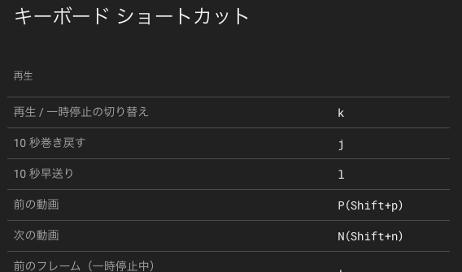
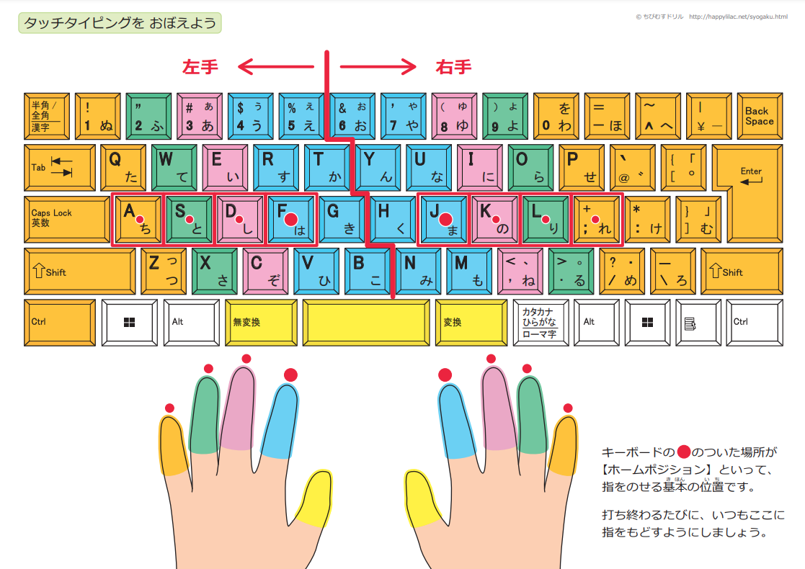
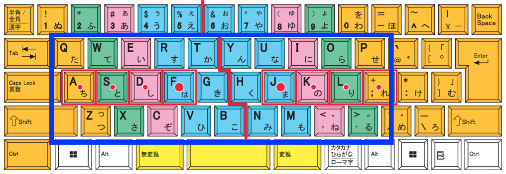

# <!--fit--> 第 15 回 CoderDojo 磐田

## タイピング特集

2024 年 8 月 18 日 (日)

---

## 目次

- なぜタイピング特集？
- 目標とする腕前
- 練習を始める前に知っておきたい
- おすすめの練習法
- まとめ

---

## なぜタイピング特集？

### いまの時代を生きる上で強力な武器になる

#### タイピングの上達で、パソコン操作が早くなる

- 短時間でたくさんのことができる
- インターネットも効率よく扱える

---

### 具体的にいうと？

- 検索が得意になる
  - 学習や趣味問わず、素早く調べ物ができる
- オンライン学習もし易くなる
  - 課題の回答やレポートの入力
  - 質疑応答（今後は講師が AI になる可能性も高い
- ショートカットキーが活用でき、パソコン操作も数倍に

---

例：YouTube のショートカット抜粋 (`?`キーを押すと表示される)

---

## 目標とする腕前

### パソコンの一般的な利用で十分な水準

- キーボードを見ない入力、タッチタイピングができる
  - 完璧にできなくとも、8 割以上打てる
- 1 分あたりの入力文字数、WPM 200 以上
  - きちんと練習すれば、多くの人は到達可能

---

## 練習を始める前に知っておきたい

- かな入力よりも、ローマ字入力を使う
  - 覚えるキーが少なく、タイピングにおける主流
- キーボードを叩いて練習する
  - 自分の指の感覚でキーの位置を覚える
- 常にキーボード上の同じ場所に手を置く
  - 「ホームポジション」がタイピングの基本

---

「【パソコンのタッチタイピング】 ホームポジションの指の位置（図解）　無料ダウンロード・印刷」, ちびむすドリル【小学生】, <a href="https://happylilac.net/sy-keyboard03.html">https://happylilac.net/sy-keyboard03.html</a>

---

### 補足

- ホームポジションは基本の型ではあるが絶対ではない
  - 自分で打ちやすい指を使えば OK
- 数字や記号よりも、まず英字を覚えるのがおすすめ
  - 英字は比較的打ち易く、文章が打てる

---

## おすすめの練習法

## [e-typing](https://www.e-typing.ne.jp/)

---

### [e-typing](https://www.e-typing.ne.jp/)とは？

#### 国内最大級の タイピング練習サイト

- 豊富な練習メニュー
- 練習記録を確認できる
- 無料で全機能使える\*

\*一部機能は要会員登録

---

### すでに他で練習しているのですが...💦

慣れ親しんだものであれば OK
タイピング上達には、以下を満たしていることが望ましい

- ローマ字入力対応
- 練習記録を確認できる
- 練習中にホームポジションが表示される

---

## まとめ

- タイピングはいまの時代を生きる強力な武器になる
- タッチタイピングかつ WPM 200 以上を目標とする
- ローマ字入力とホームポジションを身につける
- 練習は e-typing、もしくは似た機能があるものを使う
