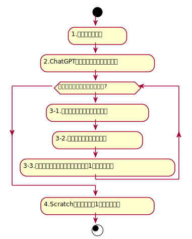

# Typing Dojo II with GPT Beta


---

## Typing Dojo基本動作
課題文配列生成後、1~3を繰り返す


<span style="font-size: 25%;">
<a href="https://scratch.mit.edu/projects/1036221510/">https://scratch.mit.edu/projects/1036221510/</a>
</span>


---

### カスタムブロックで課題文配列を生成


---

「GPTで課題文・英字群を生成する」ブロックの
フローチャート


---

「2.ChatGPTで課題文を生成要求を送信」の
JavaScriptコード


```js
const OpenAI = require("openai");
const openai = new OpenAI();

const completion = await openai.chat.completions.create({
    messages: [{ 
      role: "user", 
      content: getKadaiListCreationPrompt(userType), // 課題文を作るプロンプト
    }],
    model: "gpt-4o-2024-08-06",
    response_format, // JSONスキーマ定義 (Structured Outputs)
});
```

<span style="font-size: 25%;">
<a href="https://platform.openai.com/docs/quickstart?quickstart-example=completions">https://platform.openai.com/docs/quickstart?quickstart-example=completions</a>
</span>


---

課題文を作るプロンプト

```js
const getKadaiListCreationPrompt = (userType) => `
一般的な学力の${userType}が知っているであろう単語、用語、漢字で課題文章を作り、
以下の条件、フォーマットに従い30個出力してください。

## 課題文章の条件

- 学年および年齢相応の学力レベルの文章とする
- ${userType}が知らない単語、漢字は使用禁止
- 物語や作品名を使っても良い
- 実在する地名を使っても良い
- 歴史上の人物の名前を含んでも良い
- 20~80文字の文章とする
- 句読点、記号は使用しない

## フォーマット

kadai, katakanaをプロパティにもつオブジェクト配列kadaiListをもつJSON

## 出力例

{
  "kadaiList": [
    { "kadai": "物の観察", katakana: "ドウブツノカンサツ" }
    { "kadai": "社会見学", katakana: "シャカイケンガク" }
    { "kadai": "運動場で遊ぶ", katakana: "ウンドウジョウデアソブ" }
  ]
}
`;
```

<span style="font-size: 25%;">
<a href="https://developer.mozilla.org/en-US/docs/Web/JavaScript/Reference/Global_Objects/JSON">https://developer.mozilla.org/en-US/docs/Web/JavaScript/Reference/Global_Objects/JSON</a>
</span>

---

JSONスキーマ定義 (Structured Outputs)

```js
const response_format = {
    type: "json_schema",
    json_schema: {
        name: "kadai_list",
        strict: true,
        schema: {
            type: "object",
            properties: {
                kadaiList: {
                    type: "array",
                    items: {
                        type: "object",
                        properties: {
                            kadai: {
                                type: "string",
                            },
                            katakana: {
                                type: "string",
                            },
                        },
                        required: ["kadai", "katakana"],
                        additionalProperties: false,
                    },
                },
            },
            required: ["kadaiList"],
            additionalProperties: false,
        },
    },
};
```

<span style="font-size: 25%;">
<a href="https://platform.openai.com/docs/quickstart?quickstart-example=completions">https://platform.openai.com/docs/quickstart?quickstart-example=completions</a>
</span>
