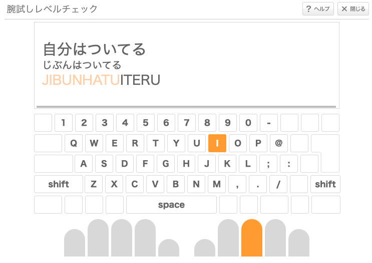

# <!--fit--> 第 16 回 CoderDojo 磐田

## タイピング特集 2

2024 年 9 月 7 日 (日)

---

## 前回のおさらい

- タイピングはいまの時代を生きる強力な武器になる
- タッチタイピングかつ WPM 200 以上を目標とする
- ローマ字入力とホームポジションを身につける
- 練習は e-typing、もしくは似た機能があるものを使う

---

## 前回のおさらい

- タイピングはいまの時代を生きる強力な武器になる
- タッチタイピングかつ WPM 200 以上を目標とする
- <u>ローマ字入力とホームポジションを身につける</u>
- 練習は e-typing、もしくは似た機能があるものを使う

---

## ローマ字

---

### ローマ字の種類

代表的なものとして、2 つの種類がある

- 訓令式
  - 内閣府告示の方式で、多くの小学校で教えられている
- ヘボン式
  - 一般に、地名や人名で広く使用されている

---

訓令式とヘボン式の代表的な違い

| ひらがな | 訓令式 | ヘボン式 |
| -------- | ------ | -------- |
| し       | SI     | SHI      |
| つ       | TU     | TSU      |
| ふ       | HU     | FU       |
| じ       | ZI     | JI       |
| ち       | TI     | CHI      |
| しゃ     | SYA    | SHA      |
| しゅ     | SYU    | SHU      |
| しょ     | SYO    | SHO      |
| じゃ     | ZYA    | JA       |
| じゅ     | ZYU    | JU       |
| じょ     | ZYO    | JO       |

---

#### 覚えるの大変そう。。。

どちらの方式でもパソコンでの入力は可能
多少ごちゃまぜに覚えてしまっていても問題なし

&nbsp; 

&nbsp; 

---

#### 覚えるの大変そう。。。

どちらの方式でもパソコンでの入力は可能
多少ごちゃまぜに覚えてしまっていても問題なし

ただ、可能であれば

タイピングにおいては**打ちやすさ**を重視しておくとよい

---

#### 「打ちやすさ」とは

- 少ない文字数で入力できる
  - 例: `し` → `SHI`より`SI`
- より人差し指に近い指で入力できる
  - 例: `じ`→ `ZI`より`JI`
- 同じ指でもより短い距離で入力できる
  - 例: `しゃ`→ `SYA`より`SHA`

---

「打ちやすさ」を踏まえると、下記**太字**がおすすめ

| ひらがな | 訓令式 | ヘボン式 |
| -------- | ------ | -------- |
| し       | **SI** | SHI      |
| つ       | **TU** | TSU      |
| ふ       | HU     | **FU**   |
| じ       | ZI     | **JI**   |
| ち       | **TI** | CHI      |
| しゃ     | SYA    | **SHA**  |
| しゅ     | SYU    | **SHU**  |
| しょ     | SYO    | **SHO**  |
| じゃ     | ZYA    | **JA**   |
| じゅ     | ZYU    | **JU**   |
| じょ     | ZYO    | **JO**   |

---

#### e-typing のローマ字入力早見表 (抜粋)

<a href="https://www.e-typing.ne.jp/datas/roma/roman_matrix.pdf">https://www.e-typing.ne.jp/datas/roma/roman_matrix.pdf</a>
※赤丸は説明のために追加している

<b>「効率よくタイピングするためのローマ字表記の早見表です。」</b> 
→ 訓令・ヘボン式の併記等を敢えてしない工夫がされている 

---

全文はここからチェックが可能

---

## ホームポジション

---

「【パソコンのタッチタイピング】 ホームポジションの指の位置（図解）　無料ダウンロード・印刷」, ちびむすドリル【小学生】, <a href="https://happylilac.net/sy-keyboard03.html">https://happylilac.net/sy-keyboard03.html</a>

---

### 押さえておきたいポイント

- ホームポジション
- 決まったキーを決まった指で押す
- ホームポジションへの指の戻し方
- キー配置の覚え方

---

#### ホームポジション

- 正確には左手が`ASDF`、右手が`JKL;`の位置
- `F`, `J`の突起に人差し指をのせるのが分かり易い

---

#### 決まったキーを決まった指で押す

- タイピングソフトの割り当てに合わせるのが基本
- 中央列の`6`, `B`は好みによるかもしれない
- 敢えて違う指で押す方法もあるが、例外は後回しで OK

---

#### ホームポジションへの指の戻し方

入力したら指をホームポジションへ戻すのが大事
ただし、必ずしも 1 文字ずつ戻す必要はない

例: `OHAYOU`と入力する場合

- 左手: `A`まで入力したら戻す
- 右手: `U`まで全部入力してから戻す

自分のやりやすい単位をみつけるとよい

---

#### キー配置の覚え方

- キーボードを見ずに入力する練習をする
- 指でキーの位置を把握する

※初心者は入力の速さよりも正確さを意識するのが良い
 
そうは言っても、難しい。。。

---

##### 実はそんなに難しくない？ e-typing の場合

画面からは、入力対象キーが`I`で、入力は右手中指を使うことがわかる
右手中指のホームポジションは`K`で、そこを基準にすると`I`はそのすぐ上にある
**→ キーの位置を覚えていなくても、キーボードを見ずにあたりをつけられる**

---

## まとめ

---

## まとめ

- ローマ字
  - 訓令式、ヘボン式どちらでもパソコンで入力できる
  - 可能であれば打ちやすさ重視で覚えると良い
  - e-typing の早見表は特におすすめできる
- ホームポジション
  - 決まったキーを決まった指で押す
  - 一定数文字打ったら指をホームポジションに戻す
  - キーボードを見ずに練習し、キーの位置を覚える

---

## Happy Typing !!

