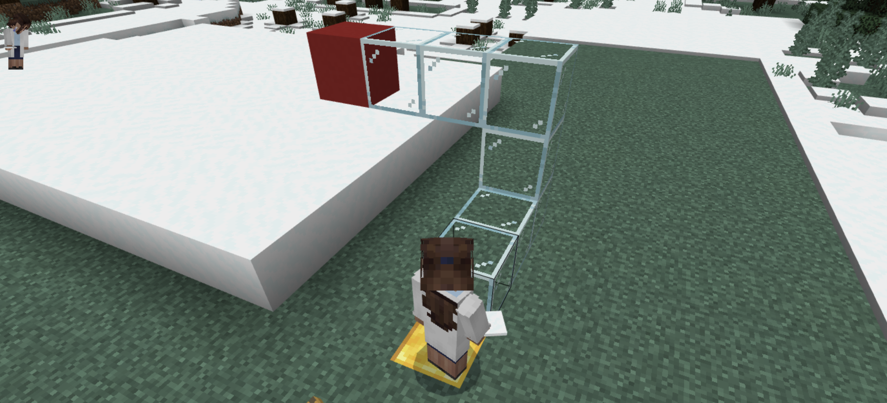
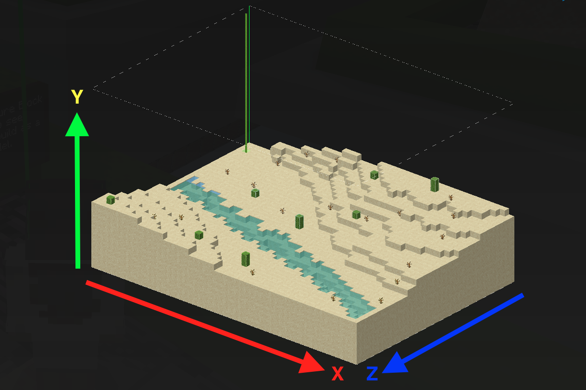

# <!--fit--> 第 17 回 CoderDojo 磐田

## 基礎から学ぶマインクラフト<br>座標編

2024 年 10 月 12 日 (土)

---

## 目次

- 座標とは
- なにがうれしい？
- マインクラフトにおける座標
- ３種類の座標
- よくある質問
- ためしてみよう

---

## 座標とは

点の位置を表す数、または数の組

→ ワールド上の「位置」を XYZ の 3 つの数字で指す



赤いブロックはどこにある？

---



<span style="color: red; font-weight: bold">X 座標</span>: 東が正、西が負
<span style="color: green; font-weight: bold">Y 座標</span>: 上が正、下が負
<span style="color: blue; font-weight: bold">Z 座標</span>: 南が正、北が負

---

## なにがうれしい？

コマンドやプログラムと組み合わせることで
建築スピードと遊びの幅を UP

例

- プレーヤーやモブを瞬間移動させる
- 一瞬で地面を平らにする
- プログラムで何かしら構造物をつくる

---

## 3 種の座標

### 絶対座標

### 相対座標

### ローカル座標

<p style="background: gainsboro; padding: 10px; font-size: 90%">
テレポートコマンドを使った<span style="font-weight: bold">確認用コマンド例</span>で、<br>
座標の概念、それぞれの違いを体験してみよう
<p>

---

### (参考) コマンド実行方法

T または Enter キーを押し「チャットとコマンド」を表示


チャット入力欄にコマンドを入力し、再度 Enter を押す


---

## 絶対座標

### ワールドの中心を原点とした座標

- 数字だけで座標を指定
- テレポートで離れた場所を指定するときに便利

<span style="font-weight: bold">確認用コマンド例:</span> `/tp 0 80 0`
→ どこにいても、実行すると同じ場所に移動

---

## 相対座標

### 自分の立ち位置を原点とした座標

- チルダ (`~`) を数字の前につける
- コマンドやプログラムで場所を指定するときに便利

<span style="font-weight: bold">確認用コマンド例:</span> `/tp ~0 ~0 ~3`
→ 立ち位置から南に３ブロック分移動

---

## ローカル座標

### 自分の立ち位置を原点とし、<br>Z 軸（南）を視点の方角とする座標

- キャレット (`^`) を数字の前につける
- 視点は画面中心にある`＋`で確認する
- 向きを確認せずに`tp`や`fill`を使いたいときに便利

<span style="font-weight: bold">確認用コマンド例:</span> `/tp ^2 ^0 ^5`
→ 立ち位置から左に 2 ブロック、前に 5 ブロック分移動

---

## よくある質問

- Q1.自分がどこにいるかわかりません
- Q2.自分がどの方角を向いているかがわかりません
- Q3.東西や南北の正負を覚えられません

---

### Q1.自分がどこにいるかわかりません

### A1.座標表示を有効にしましょう

---

#### 座標表示を有効にする

表示の切り替えをおこなう 2 つの方法

- メニューから: 設定 > ゲーム > **座標を表示**

- コマンドから: 下記を実行\*

```
/gamerule showcoordinates true
```

\*最後の`true`を`false`にして実行すると、
座標表示を無効にできます

---

### Q2.自分が向いている方角がわかりません

### A2.何か目印か、`tp` を使いましょう

---

#### 石レンガブロックを目印にする


石レンガブロックを真上からみた様子

---

#### 縦横の回転角を指定した`tp`で真南を向く

`/tp ~ ~ ~ 0 0`

→ /tp <位置: x y z> <横回転角> <縦回転角>


実行例（左: 実行前、右: 実行後）
この方法なら石レンガブロックなしでも確認できる

---

### Q3.方角毎の座標の正負を覚えられません

### A3.南を向くのがおすすめです

---

### 南を基準として座標を把握する

X 軸、Y 軸、Z 軸をそれぞれ正方向で確認できる


石レンガブロックを北東から南西方向に見た様子

---

### いかがでしたでしょうか

3 種 の違いを知り、場面に応じて使い分けよう

- 絶対座標
- 相対座標
- ローカル座標

まずは小さく、ひとつのコマンドで試すのがおすすめ

---

## ためしてみよう その 1

### [setblock](https://minecraft.fandom.com/ja/wiki/%E3%82%B3%E3%83%9E%E3%83%B3%E3%83%89/setblock)

指定した座標にブロックをひとつ置くコマンド

例: `/setblock ~3 ~1 ~5 stone`

- 座標を変えて実行してみよう
- 狙った場所にブロックを置けるかな？

---

## ためしてみよう その 2

### [fill](https://minecraft.fandom.com/ja/wiki/%E3%82%B3%E3%83%9E%E3%83%B3%E3%83%89/fill)

始点座標から終点座標まで指定ブロックで埋めるコマンド

例: `/fill ~ ~ ~1 ~2 ~2 ~3 dirt`

- 数字やブロック名を変えて実行をためしてみよう
- 空気ブロック(`air`)を指定すると、穴を空けられるよ

---


# 続編を乞うご期待
