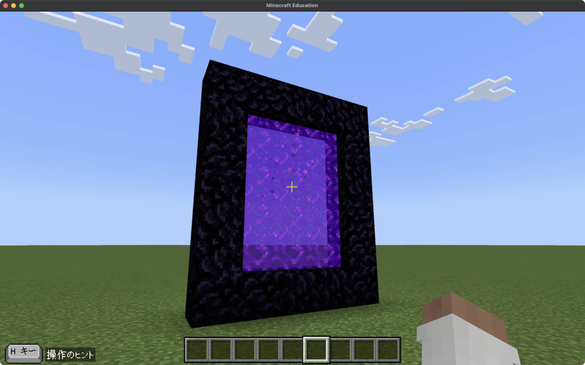
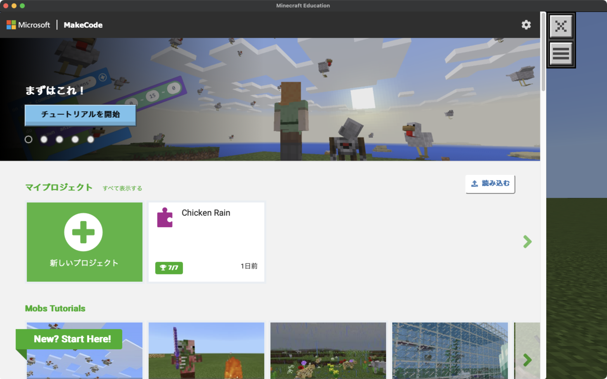
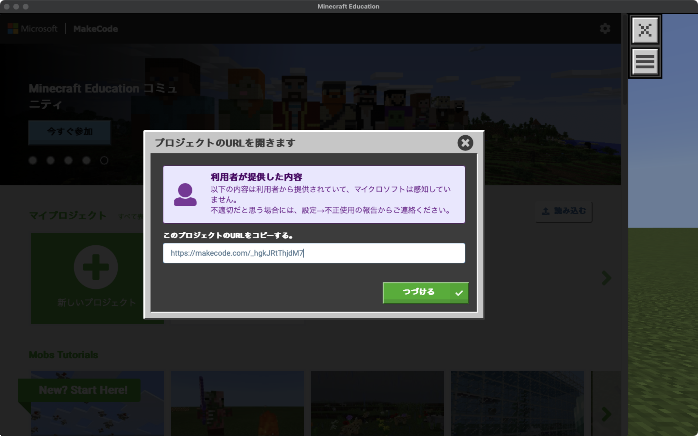
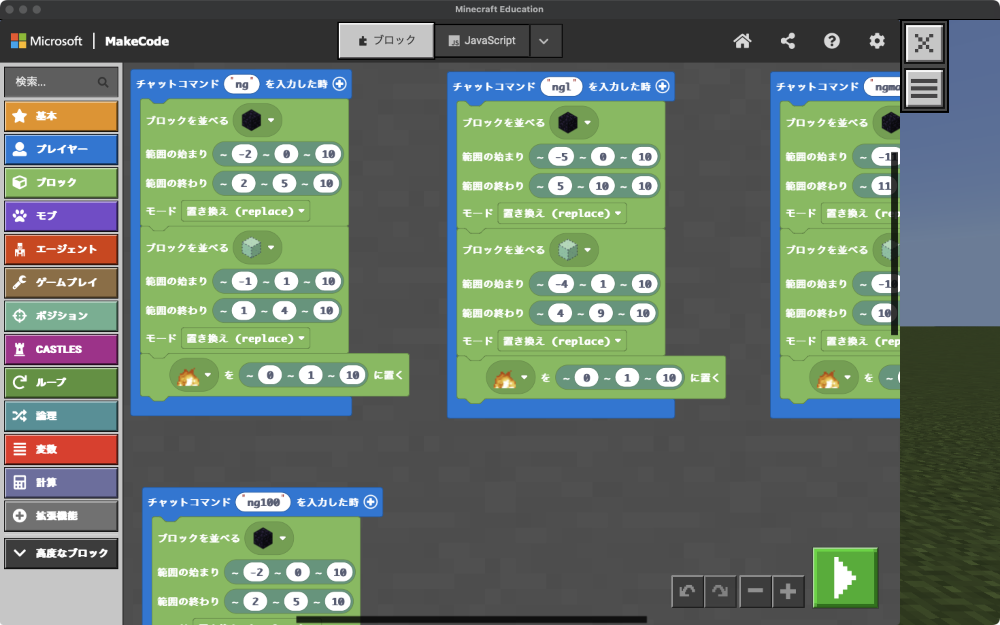
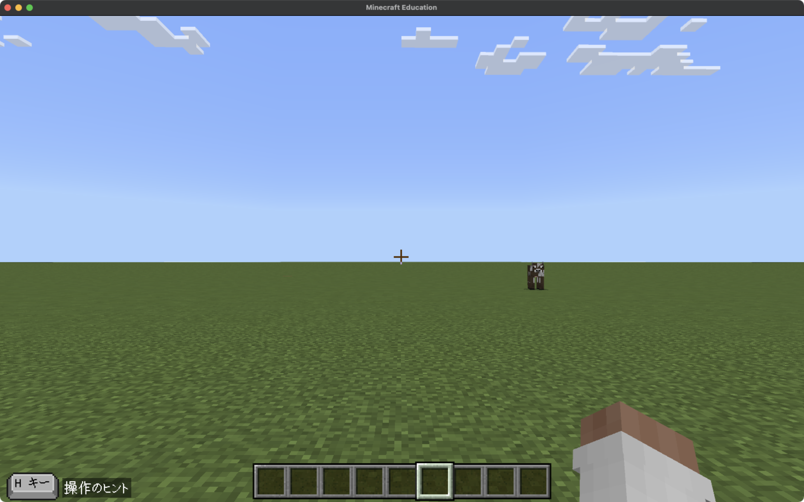
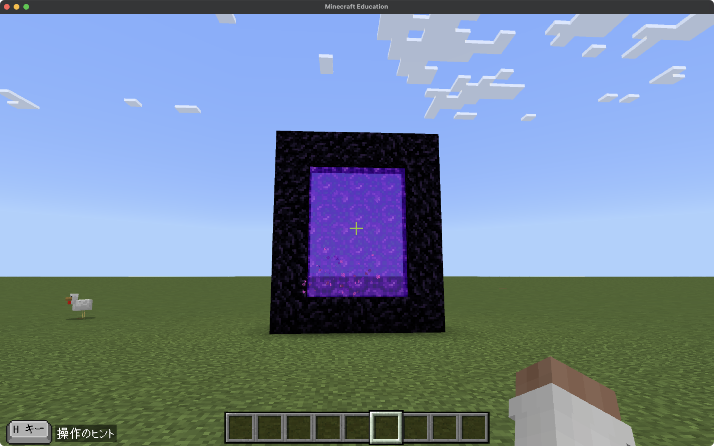

# <!--fit--> Nether Gate Builder

## チャレンジ課題 解答例

---

MakeCode では
他の人が共有したプロジェクトを読み込む機能があります
ここでは解答例のプロジェクトを読み込んでみましょう

手順は以後のスライドで解説します

---

MakeCode を開き 読み込む ボタンを押す

---

`https://makecode.com/_hgkJRtThjdM7`を入力し、
つづける ボタンを押す

---

読み込み完了を確認したら MakeCode を閉じます

---

ワールドに戻ったらチャットコマンドを開きます

---

`ng`と入力し、実行すると...

---

ネザーゲートが自動で建築されます！

---

## ためしてみよう

このプロジェクトで実行できるコマンド一覧です
ぜひおためしあれ

- `ng`: 最小サイズのネザーゲート
- `ngl`: 大きめサイズ
- `ngmax`: 最大サイズ
- `ng100`: ...自分の目で確かめてみよう 👀

---

## プログラムを読んでみよう

一通り実行を試したら、プログラムも読んでみよう 👀
どんなふうに書かれているかな?

---

# 以上！

